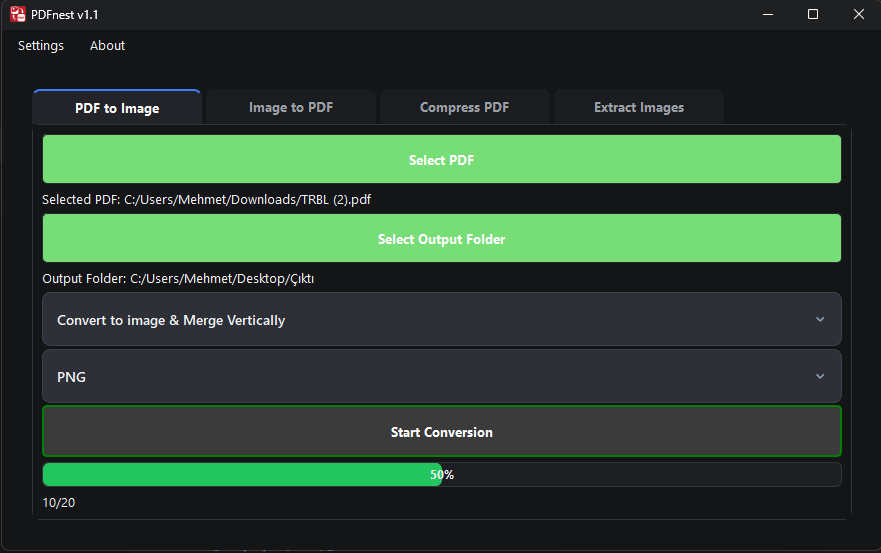
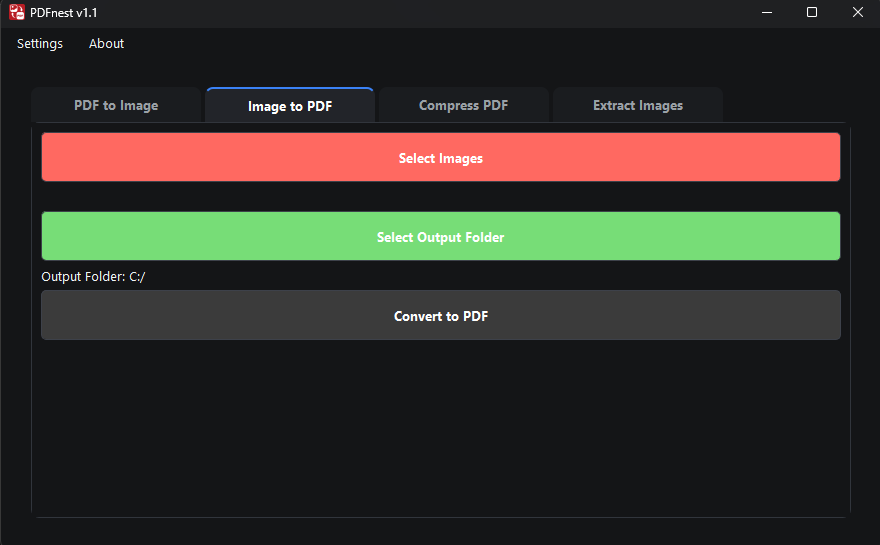
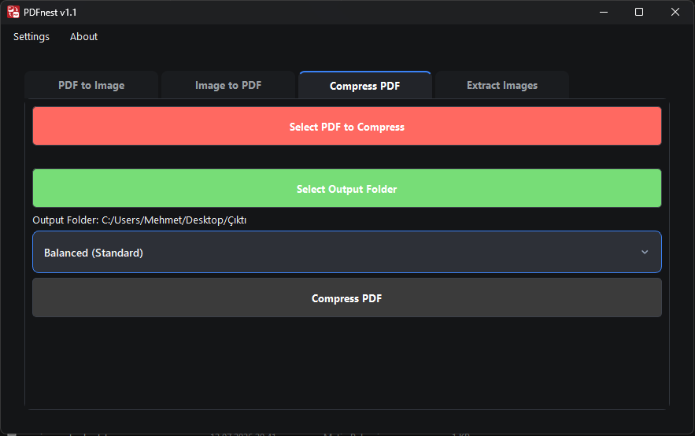
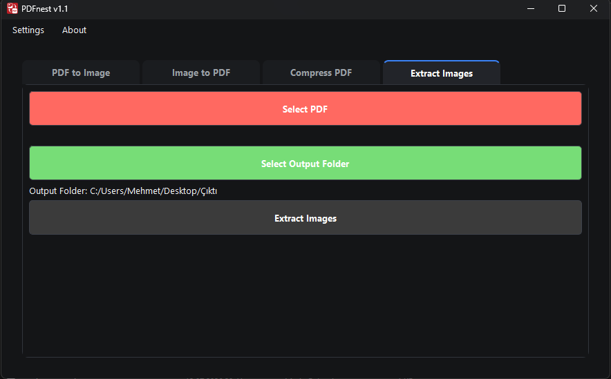

  

  <h1>PDFnest</h1>
  
Free and simple desktop PDF toolkit.

  

    <a href="#-english">English</a>
    ·
    <a href="#-türkçe">Türkçe</a>
  

---

## English

**PDFnest** is a free and easy-to-use desktop application for working with PDFs: convert pages to images, merge images into a PDF, shrink a PDF's file size, or pull out the images embedded inside a PDF.

Designed for efficiency, this tool helps you manage your documents quickly without needing complex software. It runs fully offline — nothing is ever uploaded anywhere.

### ✨ Features

* **PDF to Image:** Convert each page of your PDF files into separate image files (JPG/PNG).
* **Merge and Convert:** Convert all pages of a PDF into a single, vertically or horizontally merged image.
* **Image to PDF:** Select multiple image files and merge them into a single, organized PDF document.
* **Compress PDF:** Shrink a PDF's file size by recompressing its embedded images, while keeping the text fully selectable and searchable. Choose from 4 quality levels.
* **Extract Images:** Pull the images embedded in a PDF out to disk in their original, unmodified format.
* **Multi-Language Support:** The application is available in both Turkish and English.

### 🖼️ Screenshots

| PDF to Image | Image to PDF | Compress PDF | Extract Images |
| :-----------: | :-----------: | :-----------: | :-----------: |
|  |  |  |  |

### 🚀 Download

You can safely download the latest version of the program from the link below. The setup file allows you to easily install the program on your computer.

[**>> Download the Latest Version <<**](https://github.com/mnevres/PDFnest/releases/latest)

## Feedback and Support

Your feedback, suggestions, or any bugs you encounter are very valuable to me. You can use one of the following methods to provide feedback:

* **For General Feedback and Suggestions:**
    You can contact me directly using the [contact form](https://nevresoglu.net/programs#contact) on my website.

* **For Bug Reports and Technical Requests (Recommended):**
    The most effective way to report a bug with details or to request a new feature is by using the "Issues" section on the project's GitHub page.

    * **Bug Report for PDFnest:**
        [» PDFnest Issues Page](https://github.com/mnevres/PDFnest/issues)

---

## 🇹🇷 Türkçe

**PDFnest**, PDF'lerle çalışmanızı sağlayan ücretsiz ve kullanımı kolay bir masaüstü uygulamasıdır: sayfaları resme dönüştürün, resimleri bir PDF'te birleştirin, bir PDF'in dosya boyutunu küçültün ya da içine gömülü resimleri dışarı çıkarın.

Verimlilik için tasarlanan bu araç, karmaşık yazılımlara ihtiyaç duymadan belgelerinizi hızla yönetmenize yardımcı olur. Tamamen çevrimdışı çalışır — hiçbir veri hiçbir yere gönderilmez.

### ✨ Özellikler

* **PDF'den Resme Dönüştürme:** PDF dosyalarınızın her sayfasını ayrı resim dosyalarına (JPG/PNG) dönüştürün.
* **Birleştir ve Dönüştür:** Bir PDF'in tüm sayfalarını dikey veya yatay olarak birleştirilmiş tek bir resim dosyasına dönüştürün.
* **Resimden PDF'ye Dönüştürme:** Birden çok resim dosyası seçin ve bunları tek bir, düzenli PDF belgesinde birleştirin.
* **PDF Sıkıştırma:** Gömülü resimleri yeniden sıkıştırarak PDF'in dosya boyutunu küçültün; metin tamamen seçilebilir ve aranabilir kalır. 4 kalite seviyesi arasından seçim yapın.
* **Resimleri Çıkarma:** PDF içine gömülü resimleri, orijinal ve değiştirilmemiş hâlleriyle diske çıkarın.
* **Çoklu Dil Desteği:** Uygulama, Türkçe ve İngilizce dil seçeneklerine sahiptir.

### 🖼️ Ekran Görüntüleri

| PDF'den Resme | Resimden PDF'ye | PDF Sıkıştırma | Resim Çıkarma |
| :-------------: | :---------------: | :--------------: | :--------------: |
|  |  |  |  |

### 🚀 İndirme

Programın en güncel sürümünü aşağıdaki bağlantıdan güvenle indirebilirsiniz. Kurulum dosyası, programı bilgisayarınıza kolayca kurmanızı sağlar.

[**>> En Son Sürümü İndir <<**](https://github.com/mnevres/PDFnest/releases/latest)

### Geri Bildirim ve Destek

Programla ilgili görüşleriniz, önerileriniz veya karşılaştığınız hatalar benim için çok değerli. Geri bildirimde bulunmak için aşağıdaki yöntemlerden birini kullanabilirsiniz:

* **Genel Görüş ve Öneriler İçin:**
    Web sitemdeki [iletişim formunu](https://nevresoglu.net/programs#contact) kullanarak bana doğrudan ulaşabilirsiniz.

* **Hata Bildirimi ve Teknik Talepler İçin (Tavsiye Edilen):**
    Karşılaştığınız bir hatayı detaylarıyla bildirmek veya yeni bir özellik talep etmek için en etkili yöntem, projenin GitHub sayfasındaki "Issues" bölümünü kullanmaktır.

    * **PDFnest için Hata Bildirimi:**
        [» PDFnest Issues Sayfası](https://github.com/mnevres/PDFnest/issues)

---

### 👨‍💻 Geliştirici

**Mehmet Nevresoğlu**

* **Website:** [nevresoglu.net](https://nevresoglu.net)
* **LinkedIn:** [linkedin.com/in/mehmet-nevresoglu-bb44341a/](https://www.linkedin.com/in/mehmet-nevresoglu-bb44341a/)

Bu ücretsiz aracı geliştirmeye devam edebilmem için desteğinizi bekliyorum!

